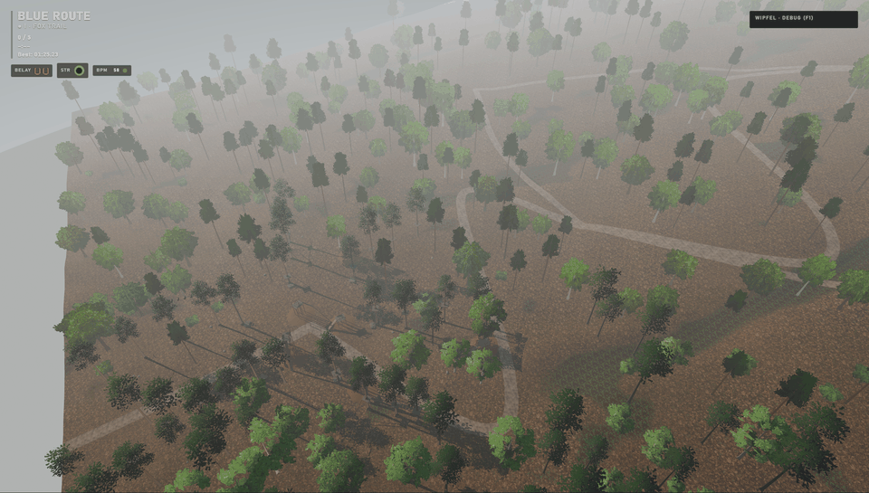
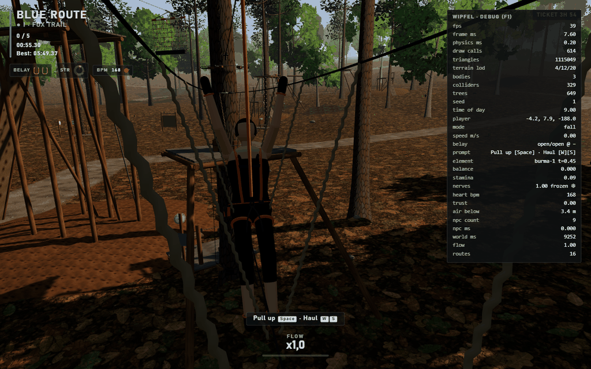
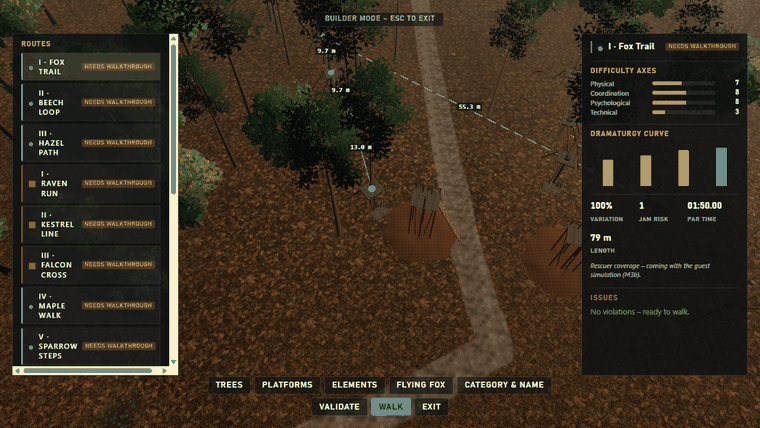
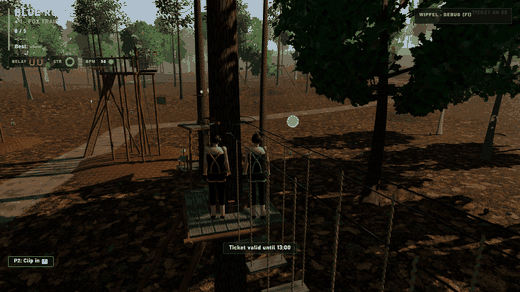
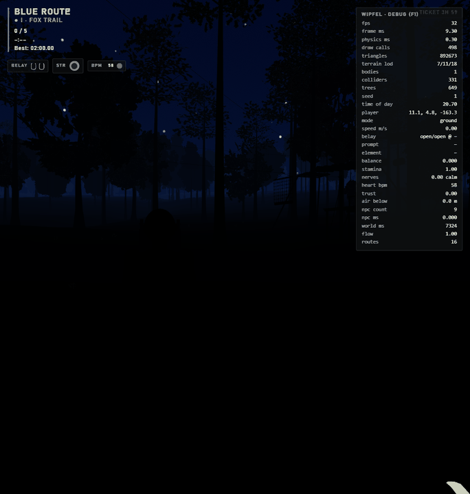

# Wipfel

A **high-ropes climbing park**, in the browser. Clip into the belay, climb from tree to tree across
wobbling bridges, nets and beams twelve metres up, and ride the flying fox down. Balance, arm strength
and nerve are the whole game — no health bars, no combat, just you, a plank and two carabiners.

Built with **Three.js** (rendering) and **Rapier** (physics) as a static website: no build step, no
framework, no backend, no CDN. Every asset is **procedural** — geometry in code, textures on a canvas,
audio synthesised in the browser.



## Quick start

No install, no build. You only need Python 3.8+ for a local static server:

```bash
python serve.py
# → http://127.0.0.1:8200/
```

Any static file server works; `serve.py` just adds no-store caching and the right MIME types.

## Controls

| Input | Action |
|---|---|
| Left stick / **WASD** | Move along the obstacle; sideways = lean into the wobble; walk on platforms |
| Right stick / **Mouse** | Look around (looking down raises your nerves) |
| LT / RT · **Q / E** | Grip with the left / right hand (hold) — ladders, rings, hand-lines |
| A / **Space** | Step, jump (Tarzan swing), push off the flying fox, tuck legs to land |
| X / **F** | Re-clip the belay at a platform (two clicks) |
| B / **R** | Breathe (hold) — calms the nerves |
| LB / **Shift** | Sprint (on the ground only) |
| RB / **T** | Camera: over-the-shoulder ↔ first person (auto first-person on the zip line) |
| Y / **Tab** | Park map — position, waiting times, remaining ticket |
| **E** | Interact — ticket desk, signs, ladders, clip into the flying fox |
| Start / **Esc** | Pause & options |
| **F1** | Debug panel (development) |

**URL flags:** `?seed=<n>` reproduces a park exactly · `?debug=1` shows the panel · `?autoplay=1` runs
a bot · `?fast=1` speeds up time · `?touch=1` forces the on-screen touch controls.

## What's in it

- **A full park** — 15+ belayed routes across four grades plus a hidden legendary one, junction
  platforms, toddler courses, a season pass, time trials, flow and mastery levels.
- **Three real belay modes** — continuous, smart belay, and a classic two-carabiner mode where clipping
  out of both at once ends the run with a dry accident report.
- **Flying fox / zip lines** with a proper model (gradient, sag, mass, wind, braking).
- **Night climbing**, a **photo mode**, graphics presets and basic touch controls.
- **Park builder + operator sim** — design your own park on surveyed trees, then run it: guest
  simulation with fear and panic, a playable rescuer, inspections, weather, and an economy with ratings.
- **Local two-player co-op** — shared camera, co-op obstacles, spectator cheers.
- **Deterministic** throughout: seeded RNG, a fixed 60 Hz physics step, interpolated rendering.

## Tech & architecture

Vanilla ES modules with an import map — no bundler, no TypeScript. Three.js and Rapier are vendored
under `vendor/`. The park is a **graph** (platforms = nodes, obstacles = directed edges); the same data
drives the player, the NPC guests and the builder. Obstacles are **rails** (spline + spring-damper wobble
model), the flying fox is analytic. See [`docs/architecture.md`](docs/architecture.md) for the full
picture and [`docs/GDD.md`](docs/GDD.md) for the design.

```
index.html          entry point
css/                styles
js/                 ES modules: core/ player/ world/ park/ elements/ builder/ npc/ ui/ audio/ …
assets/             procedural data (parks, catalogue, strings) — no third-party media
vendor/             Three.js, Rapier (compat WASM build)
tools/              procedural bakers and dev verification scripts
tests/              node --test unit tests + smoke tests
docs/               GDD, architecture, decisions (ADRs), research notes, screenshots
serve.py            static dev server
```

## Development

```bash
node tools/check-all.mjs                     # syntax gate for every JS file
node --test "tests/unit/**/*.test.mjs"       # pure-logic unit tests
node tests/smoke.mjs                         # optional headless smoke test (needs playwright-core)
```

Contributor and AI-agent guidelines live in [`CLAUDE.md`](CLAUDE.md) / [`AGENTS.md`](AGENTS.md); the
milestone plan is in [`ROADMAP.md`](ROADMAP.md). This project was developed with AI coding agents, which
is why those guides are first-class files in the repo.

## Screenshots

| | |
|---|---|
|  |  |
|  |  |

## Design & realism

The park is fictional (“Waldseilpark Sonnwendberg”) but the numbers are grounded in how real high-ropes
courses are built and run — belay classes, flying-fox physics, tree-platform construction, pacing rules.
Those references are collected, anonymised, in [`docs/RESEARCH-DATA.md`](docs/RESEARCH-DATA.md).

## License

Released under the **MIT License** — see [`LICENSE`](LICENSE). The game code and all in-game assets are
original and procedural (no third-party game media). The only third-party code is vendored in `vendor/`:
**Three.js** (MIT) and **Rapier** (Apache-2.0), each under its own license.
